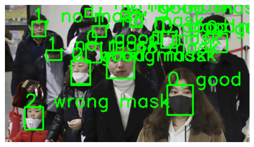

# Mask-Object-Detection
yolov5를 활용한 마스크 인식 시스템 구현

## 가장 좋은 모델 
batch size 16, epochs 300으로 학습 진행
### Train Result

1. Loss : 값이 모두 감소하고 있는 것을 보아 학습이 잘 진행되고 있음을 알 수 있습니다. 
2. 정밀도 : 초반에는 변동이 크지만, 0.9에 가까운 값으로 모델이 클래스를 잘 구분하고 있음을 알 수 있습니다.
3. 재현율 : 0.8에 가까운 값으로 모델이 클래스를 잘 구분하고 있음을 알 수 있습니다. 
4. mAP_0.5 : 0.8 이상의 값으로 모델이 전반적으로 높은 예측 성능을 가지고 있음을 알 수 있습니다.

### PR Curve

- mAP@0.5의 정확한 수치를 확인하기 위해 그래프를 출력합니다.
- 그래프의 라벨을 통해 mAP@0.5는 0.860임을 알 수 있습니다.
- 모델의 성능이 0.86으로 높은 수치를 갖고 있어 2번 모델의 성능이 좋다고 판단할 수 있습니다.
- 1번 모델보다 높은 점수를 갖고 있어 현재 최적의 모델은 2번 모델입니다.

## 객체 인식 과정

1. 라이브러리
- torch: YOLOv5 모델을 로드하고 예측에 사용됩니다.
- os: 파일 및 디렉토리 경로 처리를 위해 사용됩니다.
- matplotlib.pyplot: 이미지를 출력하기 위해 사용됩니다.
- cv2 (OpenCV): 이미지 처리 및 바운딩 박스 그리기에 사용됩니다.
- matplotlib.image: 이미지를 읽기 위해 사용됩니다.

2. 이미지 및 라벨 파일 로드
- 이미지 파일과 라벨 파일은 각각 ./../data/test/images/와 ./../data/test/labels/ 디렉토리에서 가져옵니다.
- 디렉토리에서 .png 확장자의 이미지 파일과 .txt 확장자의 라벨 파일을 필터링합니다.

3. 사람 수 확인
- 라벨 파일을 열어 각 라인의 수를 세어 이미지 속 사람의 수를 확인합니다.
- 이 정보는 라벨 파일에서 제공되며, 라벨 파일의 각 라인은 이미지 속 한 사람을 나타냅니다.

4. 이미지 출력
- 선택된 이미지의 원본 파일을 열고 matplotlib 라이브러리를 사용하여 출력합니다.

5. YOLOv5 모델 로드 및 예측
- torch.hub.load를 사용하여 커스텀 YOLOv5 모델을 로드합니다.
- 선택된 이미지에 대해 모델 예측을 수행합니다.

6. 예측 결과 시각화
- 예측된 결과를 시각화하기 위해 cv2를 사용하여 바운딩 박스를 그립니다.
- 각 객체에 대해 바운딩 박스를 그리고, 객체의 클래스에 따라 라벨 텍스트를 이미지에 추가합니다. 텍스트는 아래와 같이 출력합니다.
0, good mask
1, no mask
2, wrong mask

7. 결과 출력
- 바운딩 박스와 라벨 텍스트가 추가된 이미지를 matplotlib를 사용하여 출력합니다.

## 결과
- 원본 사진 및 모델 객체 인식 결과 사진
- ReadMe에는 결과 일부만 포함되어 있습니다. 
- 다양한 결과는 .ipynb파일에서 확인할 수 있습니다.

### 1인 사진
|원본사진|결과|
|---|---|
|||
- 위 사진은 1명이 마스크를 쓰고 있는 사진입니다. 
- 결과는 얼굴에 박스를 잘 그렸고, 0, good mask로 마스크를 잘 쓰고 있는 것으로 예측하였습니다.
- 위 케이스는 잘 예측한 케이스입니다.

1명인 사진들은 대부분 맞게 잘 예측하는 것을 볼 수 있었습니다.

### 2인 사진
|원본사진|결과|
|---|---|
|||
- 원본 사진은 2명이 마스크를 쓰고 있는 사진입니다. 
- 결과는 두 명 모두 얼굴에 박스를 잘 그렸고, 0, good mask로 마스크를 잘 쓰고 있는 것으로 예측하였습니다.
- 이번 케이스는 잘 예측한 케이스입니다.

2명인 사진들도 잘 분리하여 예측하는 것을 볼 수 있었습니다.

### N인 사진
|원본사진|결과|
|---|---|
|||
- 원본 사진은 14명이 있는 사진입니다.
- 박스를 여러 개를 그리기는 했지만, 결과들이 겹쳐서 제대로 확인 할 수 없었습니다.

사진 중에서 몇 명의 사람을 결과를 분석해보겠습니다. 
- 먼저 왼쪽 아래 빨간 옷을 입은 아이는 마스크를 잘못 쓰고 있는 것으로 잘 예측하였습니다.
- 아이 옆에 있는 아주머니의 경우에는 마스크를 잘못 쓰고 있는 경우지만, 0 마스크를 잘 쓰고 있음과 2 마스크를 잘못 쓰고 있음으로 중복으로 예측하였습니다.

이를 통해 사람이 많은 사진이면 예측하기 어려우며, 모델의 성능에 아쉬운 부분이 있다고 생각합니다.

## 결과 분석 및 개선 방향 제시

### Confusion Matrix

1. confusion_matrix 구성 요소
- True Labels : 실제 클래스 레이블
- Predicted Labels : 모델이 예측한 클래스 레이블
- 색상 : 정확도 값

2. good_mask 분석
- 실제 마스크를 잘 쓰고 있는 것을 잘 쓰고 있음으로 예측한 것은 0.94로 높은 수치를 갖고 있습니다. 이를 통해 마스크를 잘 착용한 사진들은 잘 인식하는 것을 알 수 있습니다.
- 실제 마스크를 잘 쓰고 있는 것을 쓰고 있지 않음과 잘 못 쓰고 있음으로 예측한 것은 수치는 나오지 않지만 색으로 분석할 수 있습니다. 두 개 모두 흰 색인 것으로 보아 쓰고 있지 않음과 잘못 쓰고 있음으로 예측하지 않은 것을 알 수 있습니다.
- 실제 마스크를 잘 쓰고 있음을 배경으로 예측한 것은 연한 하늘 색으로 몇 개는 실제 마스크를 쓰고 있는 것을 배경으로 인식한 것이 있음을 알 수 있습니다.

3. no_mask 분석
- 실제 마스크를 쓰지 않고 있는 것을 잘 쓰고 있음으로 예측한 것은 0.07로 낮은 수치를 갖고 있습니다. 이를 통해 마스크를 쓰지 않고 있는데 마스크를 쓰고 있다고 예측한 것이 조금 있다는 것을 알 수 있습니다.
- 실제 마스크를 쓰지 않고 있는 것을 쓰지 않고 있음으로 예측한 것은 수치는 나오지 않지만 색으로 분석할 수 있습니다. 색이 남색인 것으로 보아 약 0.8 정도의 수치를 갖고 있다고 볼 수 있습니다. 이는 올바르게 예측한 것이 0.8임을 알 수 있습니다.
- 실제 마스크를 쓰지 않고 있는 것을 잘 못 쓰고 있음으로 예측한 것은 수치는 나오지 않지만 색으로 분석할 수 있습니다. 색이 연한 하늘 색인 것으로 보아 0.0~0.1 사이의 수치를 갖고 있다고 볼 수 있습니다.
- 실제 마스크를 쓰지 않고 있는 것을 배경으로 예측한 것은 조금 진한 하늘 색으로 몇 개는 실제 마스크를 쓰고 있는 것을 배경으로 인식한 것이 있음을 알 수 있습니다.

4. wrong_mask 분석
- 실제 마스크를 잘못 쓰고 있는 것을 잘 쓰고 있음으로 예측한 것은 0.07로 낮은 수치를 갖고 있습니다. 이를 통해 마스크를 잘못 쓰고 있는데 마스크를 쓰고 있다고 예측한 것이 조금 있다는 것을 알 수 있습니다.
- 실제 마스크를 잘못 쓰고 있는 것을 쓰지 않고 있음으로 예측한 것은 수치는 나오지 않지만 색으로 분석할 수 있습니다. 색이 흰색인 것으로 보아 쓰지 않고 있음으로 예측한 것이 없다고 볼 수 있습니다.
- 실제 마스크를 잘못 쓰고 있는 것을 잘못 쓰고 있음으로 예측한 것은 수치는 나오지 않지만 색으로 분석할 수 있습니다. 색이 진한 남색인 것으로 보아 약 0.8 정도의 수치를 갖고 있다고 볼 수 있습니다. 이는 올바르게 예측한 것이 0.8임을 알 수 있습니다.
- 실제 마스크를 잘못 쓰고 있는 것을 배경으로 예측한 것은 연한 하늘 색으로 몇 개는 마스크를 잘못 쓰고 있는 것을 배경으로 인식한 것이 있음을 알 수 있습니다.

5. background 분석
- 배경을 잘 쓰고 있음으로 예측한 것은 0.61로 조금 높은 수치를 갖고 있습니다. 이를 통해 라벨링이 되어 있지 않은 배경에서 객체를 인식하고 마스크를 쓰고 있다고 예측한 것이 있다는 것을 알 수 있습니다. 이는 모델이 객체 인식 하는 성능이 좋다는 것을 의미합니다.
- 배경을 쓰지 않고 있음으로 예측한 것은 수치는 나오지 않지만 색으로 분석할 수 있습니다. 색이 연한 파란색인 것으로 보아 약 0.3 정도의 수치를 갖고 있다고 볼 수 있습니다. 이는 모델이 객체 인식 하는 성능이 좋다는 것을 의미합니다.
- 배경을 잘못 쓰고 있음으로 예측한 것은 수치는 나오지 않지만 색으로 분석할 수 있습니다. 색이 연한 하늘색인 것으로 보아 약 0.1 정도의 수치를 갖고 있다고 볼 수 있습니다. 이는 모델이 객체 인식 하는 성능이 좋다는 것을 의미합니다.

### 정리

#### 1. 정확도와 성능
- 해당 모델은 마스크 잘 착용 > 마스크 미 착용 > 마스크 잘 못 착용 순서로 잘 인식하고 예측하는 것을 알 수 있습니다. 
- 또한, mAP@0.5의 수치가 높은 것으로 보아 `좋은 모델`이라고 할 수 있습니다.

#### 2. 오류 사례
- 테스트 데이터로 확인했을 때는 다음과 같은 오류 사례가 있었습니다.
1. 바운딩 박스를 잘못 그리는 경우
2. 바운딩 박스를 여러 개 그리는 경우
3. 잘못 쓰고 있는 것을 안 쓰고 있다고 예측한 경우
4. 사람으로 볼 수 없지만 사람이라고 인식한 경우
- 오류가 발생하는 이유는 다음과 같다고 생각합니다.
1. 코를 눈으로 인식하는 등 신체 부위를 실제와 다르게 인식하여 마스크를 썼다고 예측한 것
2. 배경에서 사람을 인식할 때에는 배경색, 주변 사람의 존재 유무 등으로 사람을 인식한 것

#### 3. 실제 환경에서 발생할 수 있는 문제점
1. 조명 조건의 변화 : 조명에 따라 사람을 배경이라고 인식할 수 있습니다.
2. 다양한 배경 : 모델 테스트를 통해 배경을 사람으로 인식하는 경우가 있다는 것을 알 수 있습니다. 벽화와 같이 사람처럼 생긴 배경이 있다면, 이를 사람으로 잘못 인식할 수 있습니다.
3. 사진의 화질 : 실제 환경에서도 카메라로 인식하는 것이 아닌 사진으로 인식하게 되면 화질에 따라 인식을 못할 수도 있습니다.
4. 마스크 종류 : 마스크 색상 등에 대해서는 잘 인식하지만 만약, 사람이나 캐릭터가 그려진 마스크라면 2명으로 인식할 수도 있습니다.
5. 피부와 마스크 색상 : 피부와 마스크 색상이 동일하다면 잘못 인식할 수도 있습니다.

#### 4. 개선방향
1. 데이터 불균형 해결
- 이번에 사용한 데이터셋은 데이터의 불균형이 존재하는데 3개의 분류 중 마스크를 잘 쓰고 있는 사진의 비율이 많습니다.
- 이를 해결하기 위해 마스크를 잘못 쓰고 있는 사진과 마스크를 잘 쓰고 있는 사진의 수를 늘려 두 케이스의 학습을 늘려 개선할 수 있습니다.

2. 다양한 데이터 사용
- 캐릭터가 그려진 마스크나, 다양한 마스크 색상을 가진 데이터를 추가하여 학습하면 모델 성능을 개선할 수 있습니다.
- 여러 배경을 가진 데이터를 활용하면 모델 성능을 개선할 수 있습니다.

3. 여러 화질 데이터 사용
- 동일한 사진을 화질을 낮추어 학습해보는 것도 모델의 성능을 올릴 수 있는 방법입니다.
